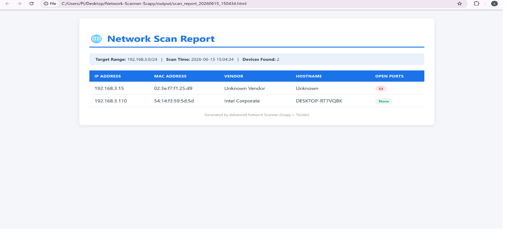

## Project Scope:
A Python-based network scanning tool that uses ARP requests to discover all 
active devices on a local network, identifies device vendors via MAC address 
lookup, performs port scanning on discovered hosts, and provides a graphical 
interface with live monitoring and report export capabilities.

## Features
- ARP-based live host discovery
- MAC address vendor identification (using IEEE manufacturer database)
- Hostname resolution
- Open port scanning (customizable port list)
- Full Tkinter GUI (no command line needed)
- Live/auto-refresh mode — detects new and disconnected devices in real-time
- Professional HTML report generation (auto-opens in browser)
- CSV report export with timestamp
- Color-coded device status (Active / New / Disconnected)

## Tech Stack
- Python 3.10+
- Scapy
- Tkinter
- Socket

## Project Structure
Network-Scanner-Scapy/

├── src/

│   ├── scanner.py    # Core scanning engine

│   └── gui.py         # GUI application (run this)

├── output/             # Generated CSV/HTML reports

├── screenshots/        # Demo screenshots

├── requirements.txt

└── README.md

## How to Run
1. Clone this repository

2. Create virtual environment:
python -m venv venv
venv\Scripts\activate

3. Install dependencies:
pip install -r requirements.txt

4. Run as Administrator (Windows) / with sudo (Linux/Mac):
python src/gui.py

5. Enter your network's IP range (e.g., 192.168.1.0/24) and click "Scan Now"

## Sample Output

## How It Works
1. Sends ARP broadcast requests to all IPs in the target range
2. Active devices respond with their MAC address
3. Vendor is identified from MAC address using IEEE manufacturer database
4. Hostname is resolved via DNS lookup
5. Common ports are checked using TCP connection attempts
6. Results displayed in GUI table and can be exported to CSV/HTML
## Use Cases
- Network security auditing
- Identifying unauthorized devices on a network
- IoT device discovery and management
- Penetration testing reconnaissance

